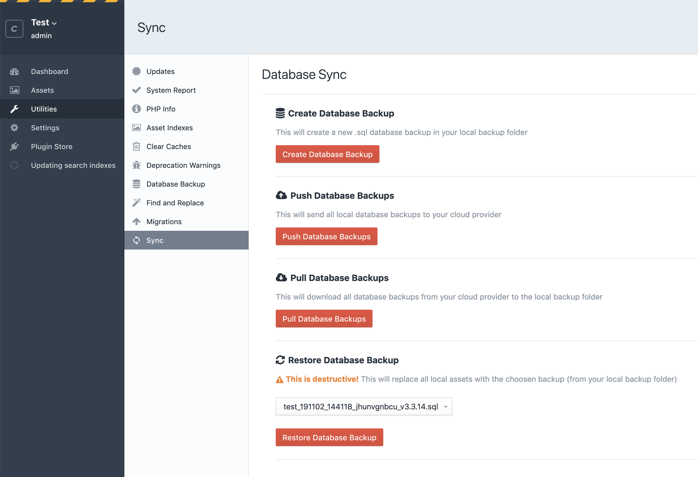
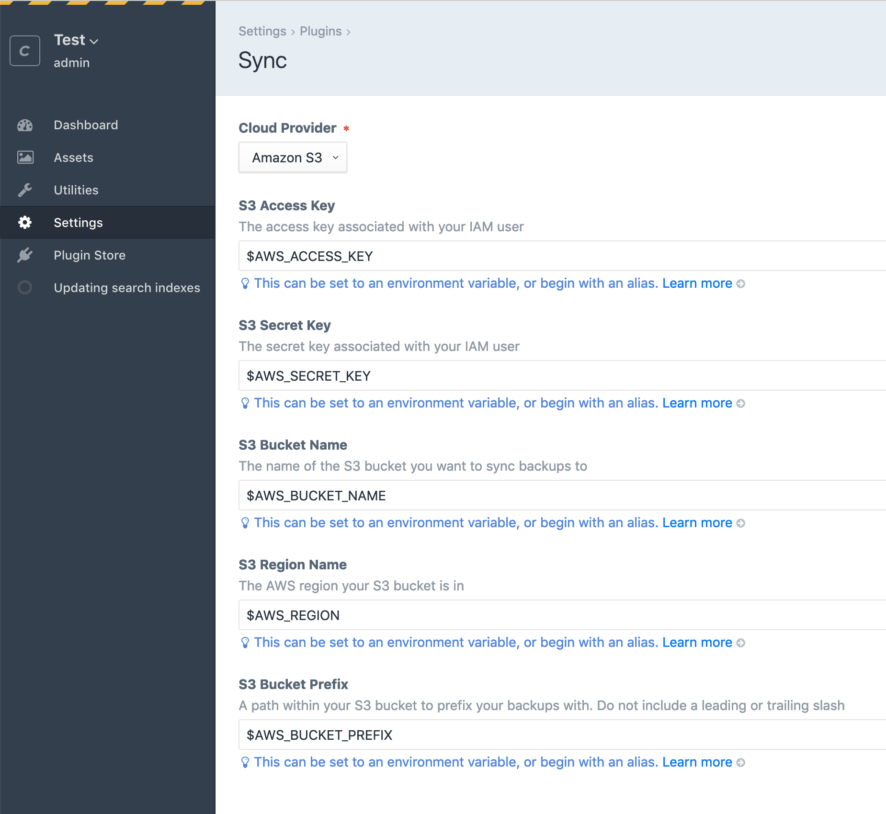
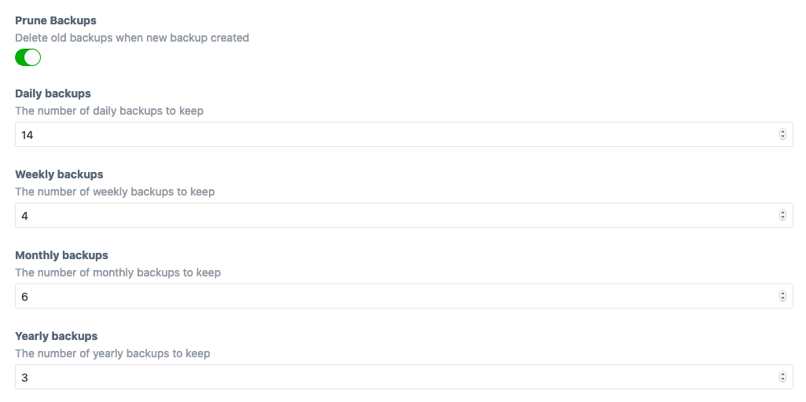

# Craft Remote Backup


Backup your database and assets to a remote destination like AWS S3.

## Overview



Craft Remote Backup makes it easy to create offsite remote backups from the comfort of the Craft Control Panel. Along with a few CLI commands, this gives you the ability to take regular snapshots of your database and assets and rest assured that they are stored securely offsite.

It provides an easy-to-configure settings page as well as an interface in Craft's "utilties" section to create new remote database and volume backups.

## Requirements

This plugin requires Craft CMS 3.0.0 or later.

## Installation

To install the plugin, follow these instructions.

1. Open your terminal and go to your Craft project:

   ```sh
   $ cd /path/to/project
   ```

2. Then tell Composer to load the plugin:

   ```sh
   composer require weareferal/remote-backup
   ```

3. In the Control Panel, go to Settings → Plugins and click the _Install_ button for Craft Remote Backup.

## Configuration

The easiest way to configure Remote Backup is via the settings page:



Alternatively, if you want to configure the plugin on a per-environment basis, you can copy the `config/remote-backup.example.php` to your project's `config/remote-backup.php` file. These settings will override the Control Panel settings.

```php
<?php
return [
    '*' => [
        'cloudProvider' => 's3',
        //...
        'useQueue' => false,
        'keepLocal' => false,
        'prune' => true,
        'pruneHourlyCount' => 6,
        'pruneDailyCount' => 14,
        'pruneWeeklyCount' => 4,
        'pruneMonthlyCount' => 6,
        'pruneYearlyCount' => 3,
    ],
    'dev' => [],
    'staging' => [],
    'production' => [],
];
```

Whichever approach you choose, you need to first configure your remote provider settings.

### Providers

Currently the only available provider is AWS S3 but more are to come soon (if you require another provider, please leave an issue on Github)

#### AWS

The details entered here correspond to your AWS S3 account and bucket that you want to use for backups. It's recommended to set up a new IAM user that has programmatic access (meaning via a acces/secret key) to a private S3 bucket.

Once you have set this bucket up, you can either enter your AWS S3 details directly into the setting page/config file, or you can use environment variables via your `.env` file (this is the recommended approach as seen in the screenshot above). This latter approach is more portable and secure as it prevents any private access/secret key values being included in files that you might commit to Github. Furthermore is means these variables can be reused in other plugins etc.

Here is an example portion of a `.env` file:

```sh
...

AWS_ACCESS_KEY="..."
AWS_SECRET_KEY="..."
AWS_REGION="us-west-2"
AWS_BUCKET_NAME="feral-backups"
AWS_BUCKET_PREFIX="craft-backups/my-site"
```

## Usage

### Control Panel Utilties


You can view and create new remote backups via the Utilities section of the Craft Control Panel.

### Command Line

There are also console commands available for creating, pushing and pulling backups:

```sh
- remote-backup/database                    Manage remote database backups
    remote-backup/database/create           Create a remote database backup
    remote-backup/database/prune            Delete old remote database backups

- remote-backup/volume                      Manage remote volume backups
    remote-backup/volume/create             Create a remote database backup
    remote-backup/volume/prune              Delete old remote volume backups
```

For example:

```sh
./craft remote-backup/database/create
```

These commands can be used alongside cron or your deployment scripts to automatically/periodically create backups.

```cron
0 * * * * /path/to/craft remote-backup/database/create
5 * * * * /path/to/craft remote-backup/database/prune
```

## Features



### Queue

You can optionally use Craft's built-in queue to create new backups. This is useful when your backups are large and you don't want to have to wait on the Control Panel interface every time you backup. Instead, the backups will be pushed to the queue and completed in the background.

You can enable this via the "Use Queue" lightswitch in the settings or via the `userQueue` settig in your config.

#### ⚠️ Control Panel errors

When not using the queue, if there is an issue pulling/pushing a backup you will get feedback (an alert box). You won't get the same feedback when using the queue. Instead it will look like the operation has been successful. To see if the operation was actually successul you'll need to check the queue manually.

#### ⚠️ CLI commands and the queue

The CLI commands ignore the queue setting. In other words, they will always run synchrously. This is by design as it's likely you will want to see the results of these operations if they are part of your crontab or deployment script.

### Local Copies

You can choose to keep local copies of database and volume backups that are created on the server before being pushed to your remote provider. By default Remote Backup will delete these local copies after they have been pushed.

If you'd prefer to keep them, enable the "Keep Local" lightswitch on the settings page or via the `keepLocal` setting in your config.

### Deleting/Pruning Old Backups

Remote Backup supports automatically pruning/deleting of old backups. To enable this feature toggle the "Prune Backup" setting or use the `prune` setting in your config.

When you toggle this setting you will see a number of inputs for controlling the number of backups to be retained for a number of backup periods: hourly, daily, weekly, monthly, yearly. By default Remote Backup will keep:

- The 6 most recent hourly backups
- The 14 most recent daily backups
- The earliest backups of the 4 most recent weeks
- The earliest backups of the 6 most recent months
- The earliest backups of the 3 most recent years

Bear in mind that depending on how many backups you have, some of these might overlay. For example, a backup that is retained as part of the 4 most recent weekly backups might also be one of the 6 most recent monthly backups too.

When enabled, backups will be pruned whenever a new backup is created via the Control Panel. You can also prune database or volume backups independently on the command line:

```sh
./craft remote-backup/database/prune
./craft remote-backup/volume/prune
```

Bear in mind these commands will respect the settings. In other words, you won't be able to prune backups via the command line if the setting in the control panel is disabled.

Also note that the `./craft remote-backup/[database|volume]/create` command does not automatically run the `prune` command (unlike the control panel).

Pruning involves automatically deleting old, out-of-date backups according to a schedule/configuration.

## Functionality

Database backups are created in a similar manner to the native Craft backup utility. In fact, the plugin uses this script behind-the-scenes, it just uses a slightly different naming scheme.

For volume assets backups, we simply create a versioned zip file containing the handles of all volume assets currently saved in the system.

All backups have the following filename structure:

```sh
my_site_dev_200202_200020_yjrnz62yj4_v3.3.20.1.sql
```

Which includes:

- Your site name
- Your current environment
- Date & time of backup
- Random 10 character string
- Craft version

It's important not to manually rename these files as the plugin relies on this structure.

## Automating backups

There is no built-in way to automate backups (periodic queue jobs are't something supported by the Craft queue). That said, it's very easy to automate backups either via cron or your own deployment script (if using Forge for example).

### Cron

Here is an example daily cron entry to backup and prune daily at 01:00:

```cron
01 01 * * * /path/to/project/craft remote-backup/database/create
02 01 * * * /path/to/project/craft remote-backup/database/prune
03 01 * * * /path/to/project/craft remote-backup/volume/create
04 01 * * * /path/to/project/craft remote-backup/volume/prune
```

## Pairing with Craft Remote Sync

[Craft Remote Sync](https://github.com/weareferal/craft-remote-sync) is a complimentary plugin that allows you to sync database and volume files between environments using same remote providers. Using these plugins together is a great way to manage remote files with your website.

When using these plugins together, it's sensible to use a different remote folder to hold your synced files and your backup files. To do this we recommend configuring your environment variables to include two separate file paths: one for sync and one for backup. 

With AWS this might look like:

```sh
AWS_ACCESS_KEY=
AWS_SECRET_KEY=
AWS_REGION="us-west-1"
AWS_BUCKET_NAME="feral-backups"
AWS_BUCKET_NAME="feral-backups"
AWS_BUCKET_SYNC_PREFIX="craft-sync/craft-test"
AWS_BUCKET_BACKUP_PREFIX="craft-backups/craft-test"
```

## Troubleshooting

If you are getting errors, the first thing to check is the Craft logs at `storage/logs/web.log`. The most likely issue is with your credentials, so double check that those are OK.

### Memory limit creating volumes

When you create a new volume backup, it's possible that your PHP memory limit will cause the process to crash. Make sure your memory limit is > than the volume folder you are trying to backup.

## Support


Brought to you by [Feral](https://weareferal.com). Any problems email [timmy@weareferal.com](mailto:timmy@weareferal.com?subject=Craft%20Env%20Sync%20Question) or leave an issue on Github.