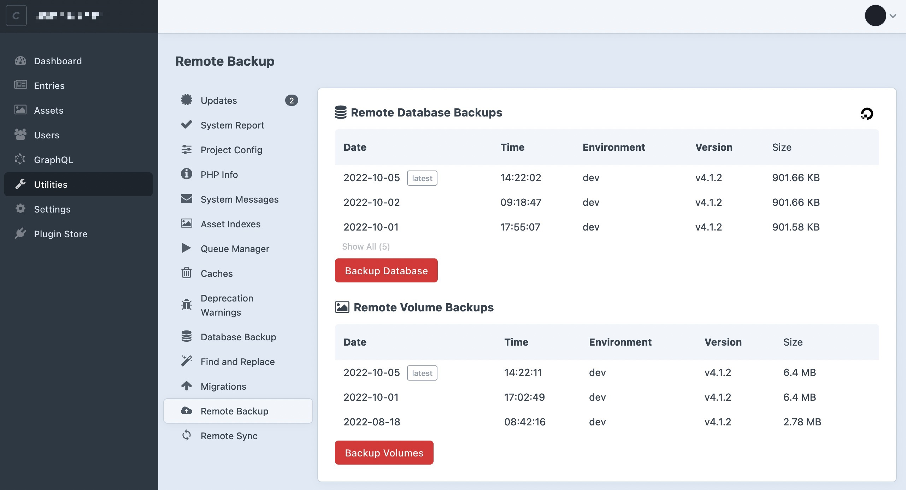

# Remote Backup Craft CMS Plugin

A [Craft CMS](https://craftcms.com/) plugin allowing you to automatically backup your database and volumes to remote cloud destinations like AWS S3, Digital Ocean, Backblaze and more.

## Features

- **Multiple cloud providers**: remote backup supports numerous cloud providers including AWS and Backblaze.
- **Background queue**: use the Craft queue to avoid hanging around for backups to complete.
- **Supports large files**: backup large multi-GB volumes and databases to remote destinations.
- **CLI commands**: automate backups using the CLI commands and cron.
- **Prunes old backups**: automatically prune old backups so you never run out of space.
- **Remote volumes**: backup remote volumes to other remote locations for peace of mind (i.e. S3 to Backblaze)

## Documentation

See [the full documentation website](https://craft-plugins.timmyomahony.com/remote-backup) for details on how to get started with the plugin.
